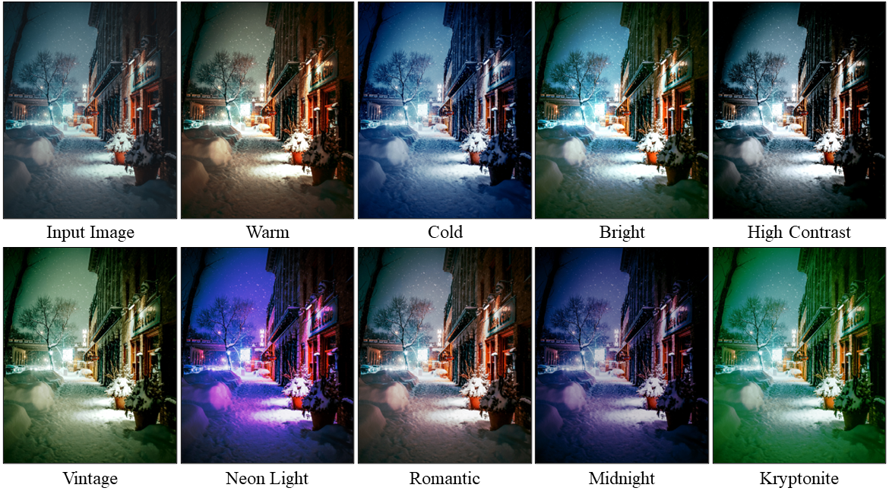

# CLIPtone: Unsupervised Learning for Text-based Image Tone Adjustment

## Introduction
This repository contains the official implementation of [CLIPtone: Unsupervised Learning for Text-based Image Tone Adjustment](https://hmin970922.github.io/CLIPtone/)(CVPR 2024).


## Prerequisites
* Ubuntu 18.04
* Cuda 11.1
* Python 3.8
* Pytorch 1.8.1

## Installation
```
git clone https://github.com/hmin970922/CLIPtone.git
cd CLIPtone
pip install -r requirements.txt
python ailut_transform/setup.py install
pip install ftfy regex tqdm
pip install git+https://github.com/openai/CLIP.git
```

## Datasets
For the training phase, both image and text datasets are required.
Detailed explanations of each type of dataset are outlined in the sections below.

### Image Dataset
In our paper, we employ the [MIT-Adobe 5K Dataset](https://data.csail.mit.edu/graphics/fivek/) as the image dataset.
To facilitate a quick setup, we utilize the dataset provided by [Zeng](https://github.com/HuiZeng/Image-Adaptive-3DLUT). ([[GoogleDrive](https://drive.google.com/drive/folders/1Y1Rv3uGiJkP6CIrNTSKxPn1p-WFAc48a?usp=sharing)], [[OneDrive](https://connectpolyu-my.sharepoint.com/personal/16901447r_connect_polyu_hk/_layouts/15/onedrive.aspx?id=%2Fpersonal%2F16901447r%5Fconnect%5Fpolyu%5Fhk%2FDocuments%2Fimage%5Fadaptive%5Flut%2Fdata&ga=1)], [[baiduyun](https://pan.baidu.com/share/init?surl=CsQRFsEPZCSjkT3Z1X_B1w):5fyk])
Please download the FiveK dataset, place it in the `./data/`, and combine the **'train_label.txt'** and **'train_input.txt'** files into a unified annotation file named **'train.txt'**, which is utilized in our training process.
Make sure to organize the directory as follows:
```
data/FiveK/
    input/JPG/480p  # input images
    expertC/
    train_input.txt
    train_label.txt
    train.txt # combine train_input.txt and train_label.txt
    test.txt
```
You are free to employ any image dataset, as the requirement for ground truth images is waived.
The necessity lies solely in the image files and an accompanying annotation file listing the image's names.

### Text Dataset
For training, Text descriptions that reflect the tonal essence of images are required.
We construct the text dataset using the [Color Names Database](https://github.com/meodai/color-names).
Download the [colornames.csv](https://github.com/meodai/color-names/blob/master/src/colornames.csv) file and place it in the `./csv/`.

We provide a script that converts the colornames.csv file into directional vectors.
To generate the directional vectors, execute the following command:
```
python save_direction_vectors.py
```
These directional vectors are then utilized as the text dataset for training.

## Training
To train our text adaptor, a [pre-trained model](https://github.com/ImCharlesY/AdaInt/blob/main/pretrained/AiLUT-FiveK-sRGB.pth) of the backbone network is required.
Please download the pre-trained model and place it in the `./checkpoint/base_network/`.
To begin the training process, execute the command below:
```
python train.py --save_path=[PATH/TO/SAVE/RESULTS]
```

## Testing
We provide a [pre-trained model](https://drive.google.com/file/d/171NTXGgme8AmSJJyy1F4hEE3OnRBQuql/view?usp=sharing) of our text adapter.
Place the downloaded model in the `./checkpoint/text_adaptor/RN50/`, and then execute the command below:
```
python test.py --save_path=[PATH/TO/SAVE/RESULTS] --prompt=[TARGET/TEXT/DESCRIPTION]
```

## Acknowledgements
Our implementation is based on the ["AdaInt"](https://github.com/ImCharlesY/AdaInt) and ["StyleGAN-nada"](https://github.com/rinongal/StyleGAN-nada).

## Citation
```
@inproceedings{lee024cliptone,
        title={CLIPtone: Unsupervised Learning for Text-based Image Tone Adjustment},
        author={Lee, Hyeongmin and Kang, Kyoungkook and Ok, Jungseul and Cho, Sunghyun},
        booktitle = {Proceedings of the IEEE/CVF Conference on Computer Vision and Pattern Recognition (CVPR)},
        year={2024}
}
```
